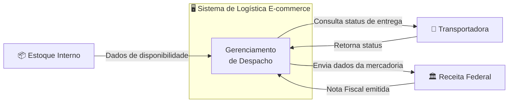
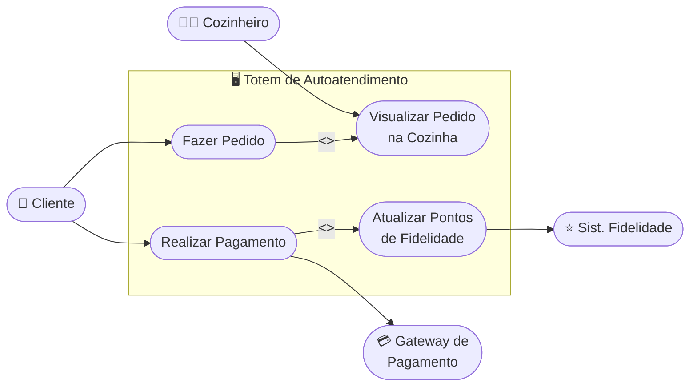
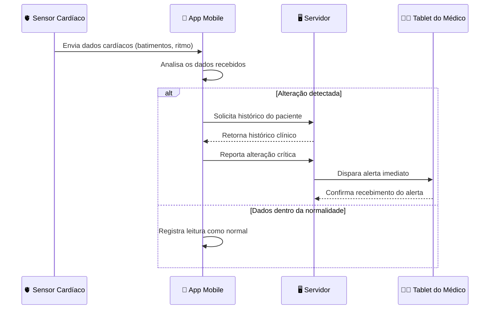
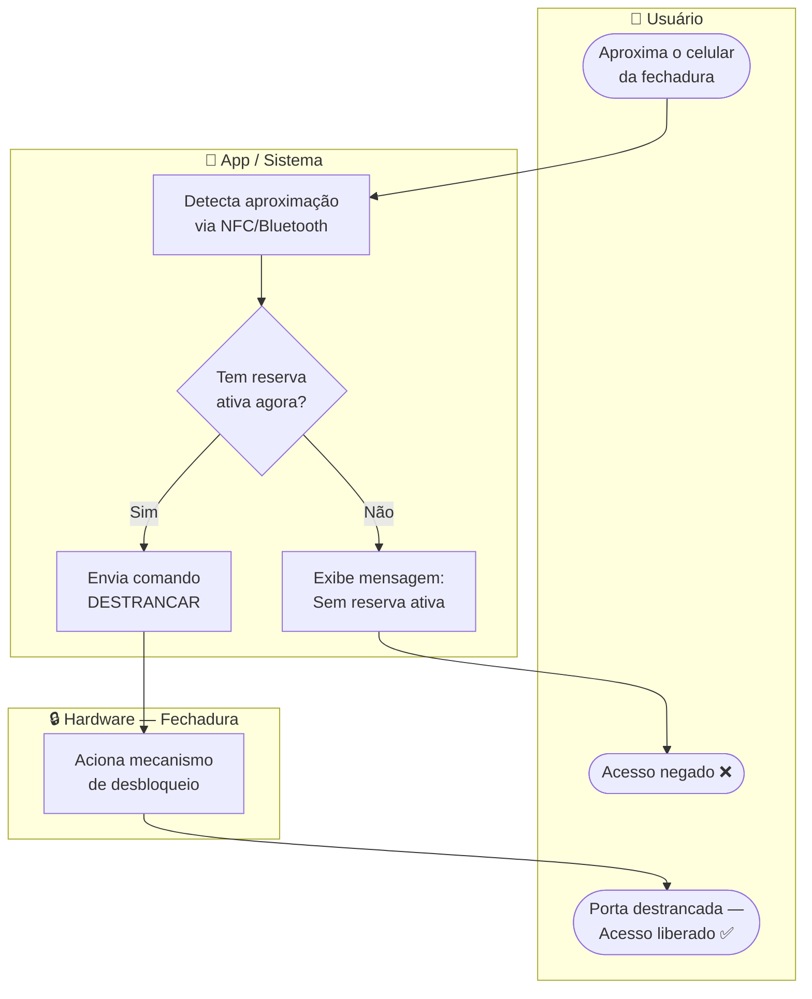
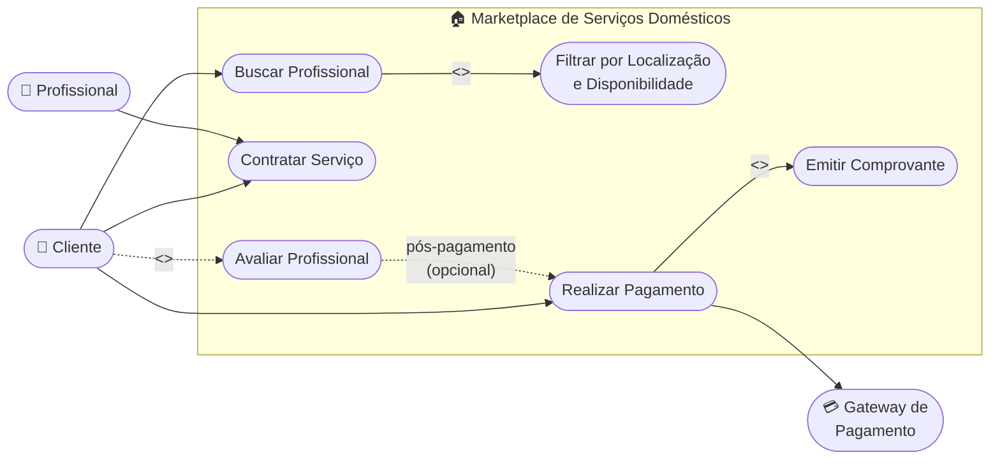

# 📐 Exercícios de Revisão — Semana 10
**Engenharia de Software** | Prof. Gaio B. Oliveira | 28/04/2026

> Modelos de Contexto e Interação (Sommerville) — Identificação de fronteiras e interação entre atores.

---

## Cenário 1 — Logística de E-commerce Global
**Diagrama Sugerido: Diagrama de Contexto**

### Análise
O **Sistema de Logística** é a caixa preta central. Tudo fora dele é entidade externa:
- **Estoque Interno** — fornece dados de disponibilidade de mercadoria
- **Transportadora** — responde com status de entrega
- **Receita Federal** — recebe dados e emite a Nota Fiscal

A fronteira deixa claro que o sistema *não controla* o estoque nem a transportadora — ele apenas se comunica com eles via interfaces definidas.

---

## Cenário 2 — Totem de Autoatendimento em Fast-Food
**Diagrama Sugerido: Diagrama de Casos de Uso**

### Análise
Os **atores** são quem interage com o sistema — diretamente (Cliente, Cozinheiro) ou indiretamente (sistemas externos como Pagamento e Fidelidade). Os **casos de uso** representam as funcionalidades de valor entregues a cada ator.

| Ator | Valor recebido |
|---|---|
| 👤 Cliente | Autonomia para pedir e pagar sem fila |
| 👨‍🍳 Cozinheiro | Visualiza pedidos automaticamente |
| 💳 Gateway de Pagamento | Processa transações do totem |
| ⭐ Sist. Fidelidade | Recebe atualização de pontos |

---

## Cenário 3 — Sistema de Telemedicina (Monitoramento)
**Diagrama Sugerido: Diagrama de Sequência**

### Análise
O foco é na **ordem cronológica das mensagens**. Usamos um bloco `alt` para representar o desvio condicional: só há consulta ao histórico e alerta ao médico **se** uma alteração for detectada. Caso contrário, o app apenas registra a leitura normal.

Participantes identificados:
1. 🫀 **Sensor Cardíaco** — origem dos dados
2. 📱 **App Mobile** — analisa e intermedia
3. 🖥️ **Servidor** — armazena histórico e dispara alertas
4. 👨‍⚕️ **Tablet do Médico** — destino do alerta

---

## Cenário 4 — Sistema de Controle de Acesso Inteligente
**Diagrama Sugerido: Diagrama de Atividades com Swimlanes**

### Análise
As **raias (swimlanes)** separam as responsabilidades de cada participante, tornando explícito **quem faz o quê** no processo:
- **Usuário** — ação física de aproximar o celular
- **App** — toda a lógica de validação e decisão
- **Hardware** — executa o comando físico de destrancar

O nó de decisão `Tem reserva ativa?` é o coração do fluxo.

---

## Cenário 5 — Marketplace de Serviços Domésticos
**Diagrama Sugerido: Diagrama de Casos de Uso (com extensões)**

### Análise das relações `<<include>>` e `<<extend>>`

| Relação | Entre | Motivo |
|---|---|---|
| `<<include>>` | Buscar Profissional → Filtrar | O filtro **sempre ocorre** ao buscar — é obrigatório |
| `<<include>>` | Realizar Pagamento → Emitir Comprovante | Comprovante **sempre** acompanha o pagamento |
| `<<extend>>` | Avaliar Profissional → Realizar Pagamento | A avaliação é **opcional** — acontece depois do pagamento, mas não é obrigatória |

> 💡 **Decisão de design:** "Avaliar Profissional" é um `<<extend>>` de "Realizar Pagamento" pois a avaliação não é mandatória para completar o fluxo principal. O sistema funciona normalmente mesmo se o cliente não avaliar.

---

## 💬 Resposta à Pergunta Final do Prof.

> *"Qual desses cenários parece o mais desafiador para definir o que está 'fora' do sistema?"*

**Cenário 1 (Logística E-commerce)** é o mais desafiador para definir fronteiras, pois o **Estoque Interno** pode causar ambiguidade: ele é parte *da empresa*, mas não parte do *sistema de logística* em si. A tentação é incluí-lo dentro da fronteira, mas o correto é tratá-lo como entidade externa com a qual o sistema se comunica por interface. Essa distinção entre "sistema da empresa" e "este sistema" é típica de projetos reais e exige clareza sobre o escopo do software.

---

## 📚 Referência

SOMMERVILLE, Ian. *Engenharia de Software*. 10ª ed. Pearson, 2019.
- Cap. 5 — Modelagem de Sistema
- Modelos de Contexto e Modelos de Interação

