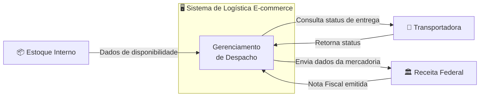

# Cenário 1 — Logística de E-commerce Global
**Engenharia de Software** | Prof. Gaio B. Oliveira | 28/04/2026

[← Voltar ao README](./README.md)

---

## 📋 Enunciado

- O sistema deve gerenciar o despacho de mercadorias.
- Precisa consultar o estoque interno e o status da transportadora.
- Deve enviar dados para a Receita Federal para emitir a Nota Fiscal.

**Diagrama sugerido:** Diagrama de Contexto

---

## 🔍 Análise das Fronteiras

O **Diagrama de Contexto** serve para mostrar o ecossistema do sistema — o que está **dentro** e o que está **fora** da sua responsabilidade.

| Entidade | Tipo | Justificativa |
|----------|------|---------------|
| Sistema de Logística | **Interno** | É o sistema em foco |
| Estoque Interno | **Externo** | Pertence à empresa, mas é um sistema separado com sua própria interface |
| Transportadora | **Externo** | Terceiro — fora do controle do sistema |
| Receita Federal | **Externo** | Órgão governamental — interface via API/webservice |

> 💡 **Decisão de design:** O "Estoque Interno" é a entidade mais ambígua. Embora pertença à mesma empresa, ele é um sistema independente com o qual o sistema de logística se comunica via interface — portanto, está **fora** da fronteira.

---

## 📊 Diagrama de Contexto

---

## ✅ Conclusão

O Diagrama de Contexto deixa explícito que o sistema **não controla** o estoque, a transportadora nem a Receita Federal — ele apenas se comunica com eles por meio de interfaces bem definidas. Isso é essencial para delimitar o escopo do projeto e identificar integrações necessárias.
