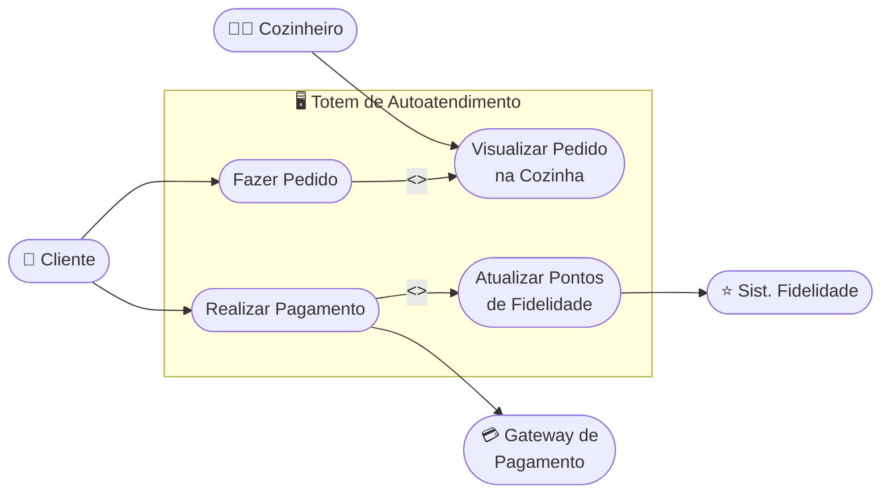

# Cenário 2 — Totem de Autoatendimento em Fast-Food
**Engenharia de Software** | Prof. Gaio B. Oliveira | 28/04/2026

[← Voltar ao README](./README.md)

---

## 📋 Enunciado

- O cliente faz o pedido no totem e paga via cartão/PIX.
- O pedido aparece no monitor da cozinha para o preparo.
- O sistema de fidelidade do cliente deve ser atualizado.

**Diagrama sugerido:** Diagrama de Casos de Uso

---

## 🔍 Análise dos Atores e Funcionalidades

O **Diagrama de Casos de Uso** foca em **quem** usa o sistema e **qual valor** ele entrega para cada ator.

### Atores identificados

| Ator | Tipo | Valor recebido |
|------|------|----------------|
| 👤 Cliente | Primário (humano) | Autonomia para pedir e pagar sem fila |
| 👨‍🍳 Cozinheiro | Primário (humano) | Visualiza pedidos automaticamente no monitor |
| 💳 Gateway de Pagamento | Secundário (sistema) | Processa as transações do totem |
| ⭐ Sist. Fidelidade | Secundário (sistema) | Recebe atualização de pontos do cliente |

### Casos de uso identificados

| Caso de Uso | Descrição |
|-------------|-----------|
| Fazer Pedido | Cliente seleciona itens no totem |
| Realizar Pagamento | Cliente paga via cartão ou PIX |
| Visualizar Pedido na Cozinha | Cozinheiro acompanha os pedidos em preparo |
| Atualizar Pontos de Fidelidade | Sistema credita pontos após pagamento confirmado |

> 💡 **Relação `<<include>>`:** "Realizar Pagamento" **sempre** inclui "Atualizar Pontos de Fidelidade" e aciona o Gateway — são partes obrigatórias do fluxo de pagamento.

---

## 📊 Diagrama de Casos de Uso

---

## ✅ Conclusão

O diagrama mostra claramente que o sistema entrega autonomia ao **Cliente** e visibilidade ao **Cozinheiro**, enquanto se integra de forma automática com sistemas externos de pagamento e fidelidade. As relações `<<include>>` garantem que os fluxos obrigatórios estejam explícitos no modelo.
