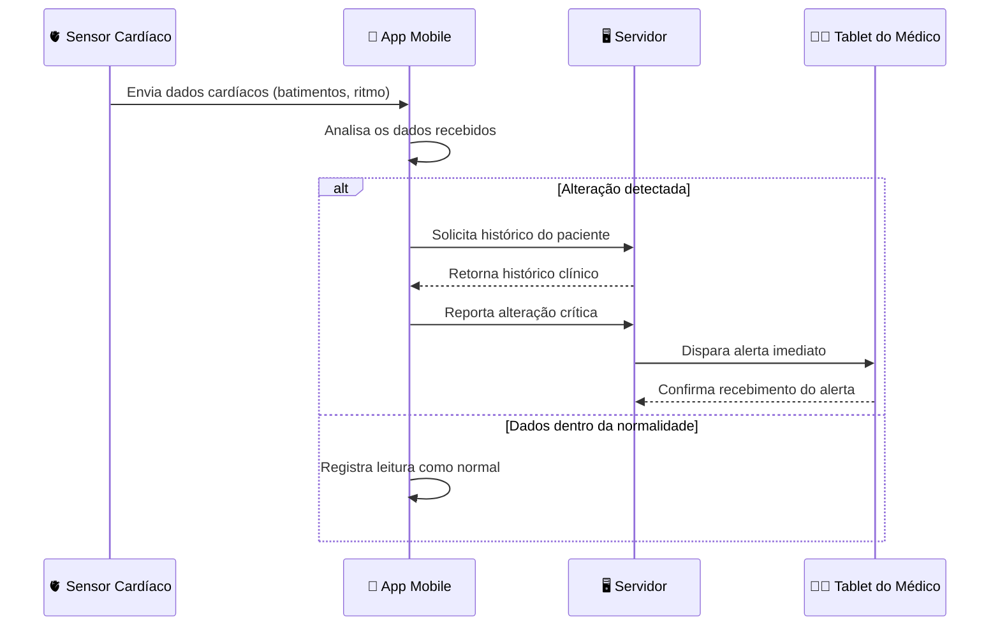

# Cenário 3 — Sistema de Telemedicina (Monitoramento)
**Engenharia de Software** | Prof. Gaio B. Oliveira | 28/04/2026

[← Voltar ao README](./README.md)

---

## 📋 Enunciado

- Um sensor cardíaco envia dados para um app mobile.
- Se houver alteração, o app solicita ao servidor o histórico do paciente.
- O servidor então dispara um alerta imediato para o tablet do médico.

**Diagrama sugerido:** Diagrama de Sequência

---

## 🔍 Análise da Ordem das Mensagens

O **Diagrama de Sequência** é ideal aqui pois o cenário possui uma **ordem cronológica crítica**: cada passo depende do anterior, e existe uma condição que bifurca o fluxo.

### Participantes identificados

| Participante | Papel no sistema |
|--------------|-----------------|
| 🫀 Sensor Cardíaco | Origem dos dados — coleta e envia batimentos |
| 📱 App Mobile | Intermediário — analisa os dados e toma a primeira decisão |
| 🖥️ Servidor | Armazena histórico e é responsável por disparar alertas |
| 👨‍⚕️ Tablet do Médico | Destino final — recebe o alerta para ação imediata |

### Fluxo principal (alteração detectada)

1. Sensor envia dados → App
2. App analisa os dados
3. App solicita histórico → Servidor
4. Servidor retorna histórico → App
5. App reporta alteração → Servidor
6. Servidor dispara alerta → Tablet do Médico
7. Médico confirma recebimento → Servidor

### Fluxo alternativo (dados normais)

1. Sensor envia dados → App
2. App analisa e registra leitura como normal (sem interação com servidor)

> 💡 **Decisão de design:** O bloco `alt/else` representa explicitamente a bifurcação condicional. Isso é fundamental para mostrar que o servidor e o médico **só são acionados quando há uma anormalidade**.

---

## 📊 Diagrama de Sequência

---

## ✅ Conclusão

O Diagrama de Sequência torna evidente que o App Mobile é o **ponto central de decisão** do sistema. Ele decide se a situação é crítica antes de envolver o servidor e o médico, evitando sobrecarga desnecessária. A linha tracejada (`-->>`) representa respostas/retornos, diferenciando-as das mensagens de chamada (`->>`).
