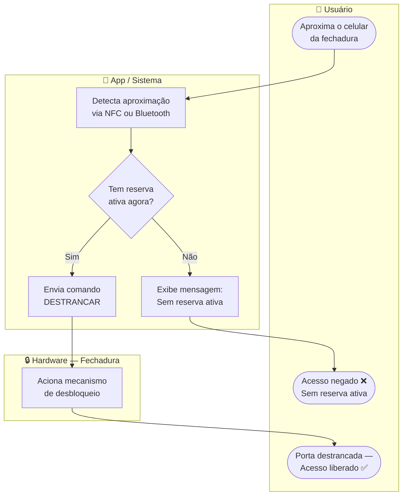

# Cenário 4 — Sistema de Controle de Acesso Inteligente
**Engenharia de Software** | Prof. Gaio B. Oliveira | 28/04/2026

[← Voltar ao README](./README.md)

---

## 📋 Enunciado

- Uma sala de reuniões só abre se houver reserva ativa.
- O usuário aproxima o celular; o sistema valida a agenda.
- Se OK, o sistema envia o comando de "destrancar" para a fechadura.

**Diagrama sugerido:** Diagrama de Atividades com Swimlanes (raias)

---

## 🔍 Análise do Fluxo e das Responsabilidades

O **Diagrama de Atividades** é ideal para mostrar o fluxo lógico do processo com suas decisões. As **swimlanes (raias)** dividem o diagrama por responsabilidade, tornando explícito **quem executa cada etapa**.

### Raias definidas

| Raia | Responsabilidade |
|------|-----------------|
| 👤 Usuário | Ações físicas — aproximar o celular e receber o resultado |
| 📱 App / Sistema | Toda a lógica de negócio — detectar, validar, decidir e comandar |
| 🔒 Hardware / Fechadura | Execução física do comando recebido |

### Nó de decisão central

```
Tem reserva ativa agora?
├── Sim → Enviar comando DESTRANCAR → Hardware aciona → Acesso liberado ✅
└── Não → Exibir mensagem de erro → Acesso negado ❌
```

> 💡 **Decisão de design:** O Hardware está em uma raia separada para deixar claro que ele é um componente passivo — apenas executa comandos, nunca toma decisões. Toda a lógica vive no App.

---

## 📊 Diagrama de Atividades com Swimlanes



---

## ✅ Conclusão

As swimlanes tornam evidente a **separação de responsabilidades**: o Usuário apenas age fisicamente, o App concentra toda a lógica de validação, e o Hardware apenas executa. Esse modelo é útil tanto para o desenvolvimento quanto para identificar onde falhas podem ocorrer — se a porta não abre, o problema está no App (lógica) ou no Hardware (físico)?
