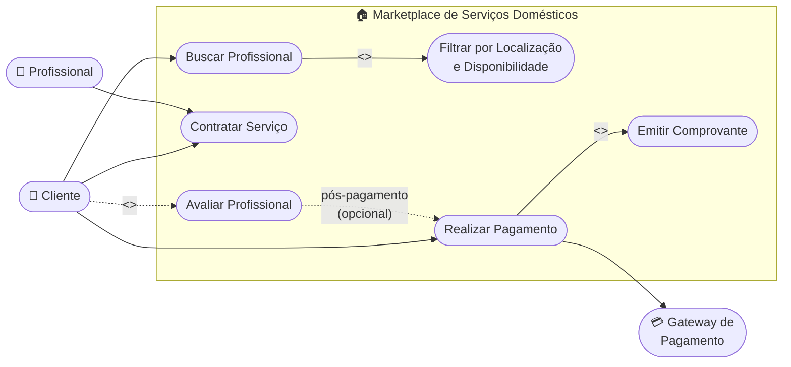

# Cenário 5 — Marketplace de Serviços Domésticos
**Engenharia de Software** | Prof. Gaio B. Oliveira | 28/04/2026

[← Voltar ao README](./README.md)

---

## 📋 Enunciado

- Clientes buscam profissionais (limpeza, reparos).
- O sistema filtra por localização e disponibilidade.
- Após o serviço, o cliente avalia o profissional e o pagamento é liberado.

**Diagrama sugerido:** Diagrama de Casos de Uso com relações `<<include>>` e `<<extend>>`

---

## 🔍 Análise das Relações entre Casos de Uso

### Atores identificados

| Ator | Tipo | Papel |
|------|------|-------|
| 👤 Cliente | Primário (humano) | Busca, contrata, paga e opcionalmente avalia |
| 🔧 Profissional | Primário (humano) | Recebe e aceita contratos de serviço |
| 💳 Gateway de Pagamento | Secundário (sistema) | Processa a liberação do pagamento |

### Casos de uso identificados

| Caso de Uso | Ator principal | Tipo |
|-------------|----------------|------|
| Buscar Profissional | Cliente | Base |
| Filtrar por Localização e Disponibilidade | Sistema | Include de "Buscar" |
| Contratar Serviço | Cliente / Profissional | Base |
| Realizar Pagamento | Cliente | Base |
| Emitir Comprovante | Sistema | Include de "Pagamento" |
| Avaliar Profissional | Cliente | Extend de "Pagamento" |

---

## 🔗 Decisão de Design: `<<include>>` vs `<<extend>>`

| Relação | Entre | Obrigatório? | Justificativa |
|---------|-------|:------------:|---------------|
| `<<include>>` | Buscar → Filtrar | ✅ Sim | Não existe busca sem filtro — sempre ocorre |
| `<<include>>` | Pagamento → Emitir Comprovante | ✅ Sim | Comprovante sempre acompanha o pagamento |
| `<<extend>>` | Avaliar → Pagamento | ❌ Não | A avaliação é **opcional** — o cliente pode pular |

> 💡 **Resposta à dica do professor:** A **"Avaliação"** é um `<<extend>>` — ela **estende** o caso de uso "Realizar Pagamento" de forma opcional. O sistema funciona corretamente mesmo que o cliente não avalie o profissional. Se fosse obrigatória, seria um `<<include>>`.

---

## 📊 Diagrama de Casos de Uso com Extensões

---

## ✅ Conclusão

Este cenário ilustra bem a diferença entre `<<include>>` (comportamento obrigatório, sempre executado) e `<<extend>>` (comportamento opcional, executado sob condição). Modelar corretamente essas relações evita ambiguidades no desenvolvimento: o time sabe exatamente quais funcionalidades são mandatórias e quais são opcionais no fluxo principal.
